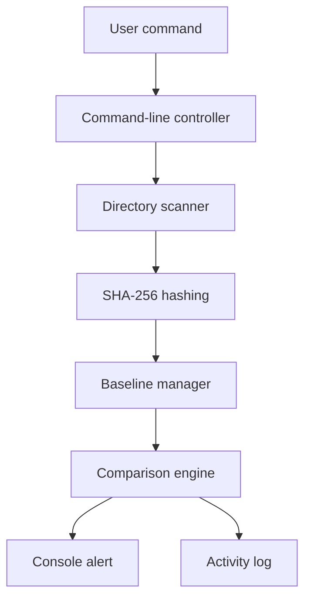
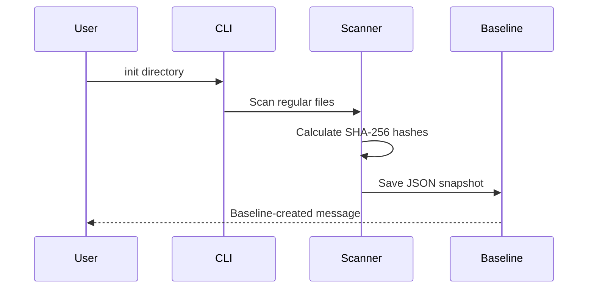
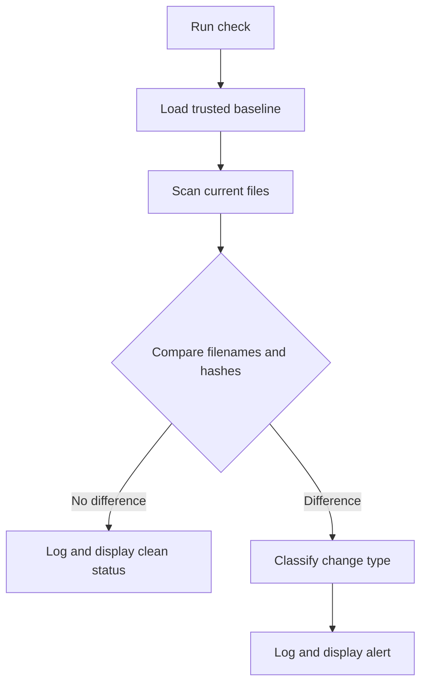

# System Architecture

## Architecture Overview

The application uses a small modular pipeline. The command-line interface
receives the user's command, the scanner reads regular files, the hashing module
creates SHA-256 fingerprints, and the baseline manager stores or loads trusted
state. During a check, the comparison engine classifies differences and sends
the result to both the terminal alert and activity log.



## Component Responsibilities

| Component | Responsibility | Python elements |
| --- | --- | --- |
| Command-line controller | Validates `init` or `check` commands and paths | `argparse`, `main()` |
| Directory scanner | Recursively discovers readable regular files | `os.walk`, `pathlib` |
| Hashing component | Generates content fingerprints in chunks | `hashlib.sha256` |
| Baseline manager | Saves and loads trusted file state | `json` |
| Comparison engine | Classifies added, modified, and deleted files | Sets and dictionaries |
| Alert component | Displays simple status and warning messages | `print` and exit codes |
| Logging component | Records events using UTC timestamps | `logging` |

## Baseline Creation Flow



## Integrity Check Flow



## Data Model

The baseline is stored as JSON:

```json
{
  "version": 1,
  "algorithm": "sha256",
  "created_utc": "2026-09-08T08:00:00+00:00",
  "monitored_path": "/example/path",
  "files": {
    "notes.txt": {
      "sha256": "example-fingerprint",
      "size_bytes": 120,
      "modified_utc": "2026-09-08T07:55:00+00:00"
    }
  }
}
```

Only the SHA-256 value determines whether existing file content changed.
Metadata helps the user understand the recorded state but does not independently
trigger an alert.

## Detection Rules

| Baseline state | Current state | Classification |
| --- | --- | --- |
| Filename absent | Filename present | Added |
| Filename present | Filename absent | Deleted |
| Same filename and different hash | File present | Modified |
| Same filename and same hash | File present | Unchanged |

Renaming a file produces one deletion and one addition because the baseline uses
relative paths as file identities.

## Security Boundaries

- The program is a defensive detection tool and does not modify monitored files.
- Symbolic links are skipped to avoid traversing unexpected targets.
- The baseline and activity log are excluded when stored inside the target.
- An attacker with permission to edit the baseline could hide changes; a future
  version should protect or digitally sign it.
- A successful integrity alert proves that content changed, not who changed it
  or whether the change was malicious.
